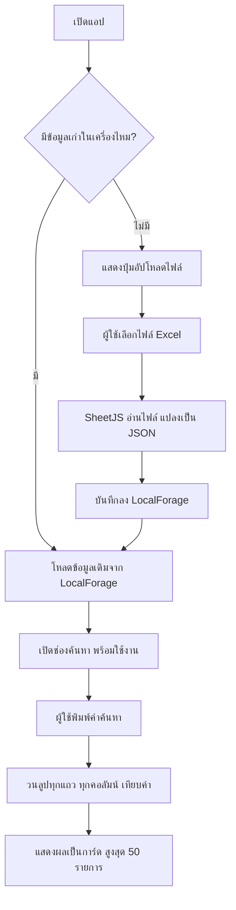

# 🔍 หูทิพย์ - ระบบค้นหาข้อมูลจาก Excel

แอปพลิเคชันค้นหาข้อมูลจากไฟล์ Excel บนมือถือ สร้างด้วย HTML + JavaScript ไม่ต้องติดตั้งโปรแกรมเพิ่ม ทำงานได้ทั้งบนคอมพิวเตอร์และมือถือ

---

## 📁 โครงสร้างโปรเจค

```
C:\AppMobile\
├── search-app.html    ← ไฟล์หลักของแอป (ต้นฉบับ แก้ไขไฟล์นี้)
├── index.html         ← สำเนาของ search-app.html (ใช้สำหรับ zip อัปโหลด)
├── AppUpload.zip      ← ไฟล์ zip สำเร็จรูป พร้อมอัปโหลดขึ้นเว็บ
└── Gemini.md          ← เอกสารนี้
```

---

## ⚙️ เทคโนโลยีที่ใช้

| เทคโนโลยี | หน้าที่ | แหล่งที่มา (CDN) |
|---|---|---|
| **HTML + JavaScript** | โครงสร้างหลักของแอป | - |
| **Tailwind CSS** | จัดหน้าตาให้สวยงาม | `cdn.tailwindcss.com` |
| **Google Fonts (Prompt)** | ฟอนต์ภาษาไทย | `fonts.googleapis.com` |
| **SheetJS (xlsx)** | อ่านไฟล์ Excel (.xlsx, .csv) | `cdn.jsdelivr.net` |
| **LocalForage** | บันทึกข้อมูลลงเครื่อง (IndexedDB) | `cdnjs.cloudflare.com` |

> [!NOTE]
> ไลบรารีทั้งหมดโหลดผ่าน CDN (อินเทอร์เน็ต) ไม่ต้องติดตั้งอะไรเพิ่ม ครั้งแรกที่เปิดแอปต้องมีเน็ต หลังจากนั้นข้อมูลจะถูกเก็บไว้ในเครื่อง

---

## 🔄 การทำงานของระบบ (Flow)



### รายละเอียดแต่ละขั้นตอน:

1. **เปิดแอป** → ระบบเช็ค LocalForage (IndexedDB) ว่ามีข้อมูลเก่าบันทึกไว้หรือไม่
2. **อัปโหลดไฟล์** → SheetJS อ่านไฟล์ Excel จาก Sheet แรก แปลงเป็น JSON Array
3. **บันทึกข้อมูล** → เก็บ JSON ลง LocalForage เพื่อใช้งานครั้งถัดไปโดยไม่ต้องอัปโหลดซ้ำ
4. **ค้นหา** → วนลูปทุกแถว ตรวจสอบทุกคอลัมน์ว่ามีคำค้นหาอยู่หรือไม่ (case-insensitive)
5. **แสดงผล** → สร้างการ์ดอัตโนมัติจากชื่อคอลัมน์ใน Excel พร้อมไฮไลท์คำที่ค้นเจอ

---

## 🎨 การปรับแต่งการแสดงผลพิเศษ (ฟังก์ชัน `renderCard`)

ระบบมีการจัดการข้อมูลพิเศษ 3 อย่างใน `renderCard()`:

### 1. ซ่อนคอลัมน์ "หมายเลขเสา"
```javascript
const skipList = ["หมายเลขเสา", "longitude"];
if (skipList.some(s => matchKey(key, s))) continue;
```

### 2. รวม LATITUDE + LONGITUDE เป็นช่องเดียว
```javascript
if (matchKey(key, "LATITUDE")) {
    labelText = "พิกัด (LAT, LONG)";
    const lat = findValue(rowData, "LATITUDE");
    const lng = findValue(rowData, "LONGITUDE");
    displayValue = `${lat}, ${lng}`;
}
```

### 3. แปลงวันที่ Excel (Serial Number) เป็นวันที่ไทย
```javascript
if (matchKey(key, "วันที่แก้ไข") && !isNaN(displayValue)) {
    displayValue = formatExcelDate(Number(displayValue));
}
```
- ฟังก์ชัน `formatExcelDate()` แปลง Excel Serial (เช่น `44356.0000462963`) → `9 มิ.ย. 2564 07:00 น.`

> [!TIP]
> ฟังก์ชัน `matchKey()` และ `findValue()` เทียบชื่อคอลัมน์แบบ **ไม่สนตัวเล็ก/ใหญ่** และ **ไม่สนช่องว่างหน้า-หลัง** เพื่อป้องกันปัญหาชื่อคอลัมน์ไม่ตรง

---

## 📱 วิธีการ Deploy ขึ้นมือถือ

### ขั้นตอนที่ 1: เตรียมไฟล์
```powershell
# คัดลอกและบีบอัดเป็น Zip (รันใน PowerShell)
Copy-Item c:\AppMobile\search-app.html c:\AppMobile\index.html -Force
Compress-Archive -Path c:\AppMobile\index.html -DestinationPath c:\AppMobile\AppUpload.zip -Force
```

### ขั้นตอนที่ 2: อัปโหลดขึ้นเว็บฟรี
1. เข้า **[https://tiiny.host](https://tiiny.host/)**
2. ตั้งชื่อลิ้งก์ (เช่น `my-excel-app`)
3. ลากไฟล์ `AppUpload.zip` ไปวาง → กด **Publish**
4. ได้ลิ้งก์ เช่น `https://my-excel-app.tiiny.site`

### ขั้นตอนที่ 3: ติดตั้งบนมือถือ (Add to Home Screen)
1. ส่งลิ้งก์เข้ามือถือ (ผ่าน LINE, Email ฯลฯ)
2. **สำคัญ:** ต้องเปิดลิ้งก์ใน **Safari** (iPhone) หรือ **Chrome** (Android) เท่านั้น ห้ามเปิดจากใน LINE โดยตรง
3. กดเมนู → **"เพิ่มไปยังหน้าจอโฮม" (Add to Home Screen)**

> [!WARNING]
> หากเปิดลิ้งก์จาก LINE โดยตรง จะไม่เจอปุ่ม "Add to Home Screen" ต้องกดเมนู "เปิดในเบราว์เซอร์" ก่อน

---

## 🛠️ วิธีแก้ไขเมื่อต้องการเปลี่ยนแปลง

### ต้องการซ่อนคอลัมน์เพิ่ม
แก้ไขตัวแปร `skipList` ในฟังก์ชัน `renderCard()`:
```javascript
const skipList = ["หมายเลขเสา", "longitude", "ชื่อคอลัมน์ที่ต้องการซ่อน"];
```

### ต้องการเปลี่ยนจำนวนผลลัพธ์ที่แสดง
แก้ค่า `MAX_RESULTS` ในส่วนค้นหา:
```javascript
const MAX_RESULTS = 50; // เปลี่ยนเป็น 100 ถ้าต้องการแสดงเยอะขึ้น
```

### ต้องการรวมคอลัมน์อื่นเพิ่ม
เพิ่มเงื่อนไขใน `renderCard()` ตามรูปแบบเดียวกับ LATITUDE/LONGITUDE

### หลังแก้ไขทุกครั้ง
1. แก้ไฟล์ `search-app.html`
2. รันคำสั่ง PowerShell เพื่อสร้าง `AppUpload.zip` ใหม่
3. อัปโหลด Zip ใหม่ขึ้น tiiny.host ทับตัวเก่า
4. บนมือถือ กดปุ่ม **"🔄 เปลี่ยนไฟล์ใหม่"** แล้วเลือกไฟล์ Excel อีกครั้งเพื่อรีเฟรชข้อมูล
